# Vision Map: The Great Transit (Spiral Architecture)

**Project:** Hypehouse Ventures - The Great Transit  
**Methodology:** Fingerprint V1 - Concentric Circle Development  
**Updated:** January 17, 2026

---

## The Spiral: From Core to Galaxy

This map visualizes the expanding architecture of "The Great Transit" game. Each layer builds upon the previous, creating a robust, scalable system that can grow from a simple ship survival simulator to a complex multi-generational space exploration experience.

```mermaid
graph TD
    %% Core Layer - The Ship Awakens
    Core[🛸 CORE: The Ship<br/>Terminal UI + Command Parser<br/>Ship-Heartbeat Engine<br/>Time Dilatation System]
    
    %% First Circle - Basic Gameplay
    Terminal[📟 Terminal Emulator<br/>Command Input/Output<br/>History & Typewriter Effect]
    Parser[🔧 MUSH Command Parser<br/>grow, repair, check, status<br/>Token-based routing]
    Heartbeat[💓 Ship-Heartbeat<br/>Power, O2, Hull, Cryo<br/>Tick-based simulation]
    TimeDil[⏱️ Time Dilatation<br/>Subjective Time Resource<br/>Speed Controls]
    
    %% Second Circle - Growth Economy
    GrowthSystem[🌱 Growth Economy<br/>Seed → Plant → Resource<br/>Growtopia-inspired crafting]
    Inventory[📦 Inventory System<br/>Items, Seeds, Materials<br/>Crafting recipes]
    CryoCrew[👥 Cryo Crew Management<br/>Wake/Sleep crew members<br/>Skill assignments]
    
    %% Third Circle - Episodes & Events
    Episodes[📖 Episode System<br/>Modular story missions<br/>Away Team mechanics]
    Events[⚡ Random Events<br/>Anomalies, Discoveries<br/>Crisis management]
    Upgrades[⬆️ Ship Upgrades<br/>Engine, Sensors, Lab<br/>Tech tree progression]
    
    %% Fourth Circle - The Galaxy
    Galaxy[🌌 The Galaxy<br/>Destination mechanics<br/>Multi-ship fleet]
    Mystery[❓ The Unknown<br/>Hidden lore<br/>End-game revelation]
    
    %% Connections - The Spiral Flow
    Core --> Terminal
    Core --> Parser
    Core --> Heartbeat
    Core --> TimeDil
    
    Terminal --> GrowthSystem
    Parser --> Inventory
    Heartbeat --> CryoCrew
    TimeDil --> Events
    
    GrowthSystem --> Episodes
    Inventory --> Upgrades
    CryoCrew --> Episodes
    
    Episodes --> Galaxy
    Events --> Mystery
    Upgrades --> Galaxy
    
    Galaxy --> Mystery
    
    %% Styling
    classDef coreStyle fill:#1a472a,stroke:#2ecc71,stroke-width:3px,color:#fff
    classDef layer1Style fill:#1a3a47,stroke:#3498db,stroke-width:2px,color:#fff
    classDef layer2Style fill:#472a1a,stroke:#e67e22,stroke-width:2px,color:#fff
    classDef layer3Style fill:#3d1a47,stroke:#9b59b6,stroke-width:2px,color:#fff
    classDef layer4Style fill:#47261a,stroke:#e74c3c,stroke-width:2px,color:#fff
    
    class Core coreStyle
    class Terminal,Parser,Heartbeat,TimeDil layer1Style
    class GrowthSystem,Inventory,CryoCrew layer2Style
    class Episodes,Events,Upgrades layer3Style
    class Galaxy,Mystery layer4Style
```

---

## System Architecture Map

---

## Current Development Status

### ✅ Completed Nodes
- Core project structure (README, .clinerules, documentation framework)
- Active Context tracking system
- Vision Map initialization

### 🔨 In Progress (Layer 1: Foundation)
- Terminal Emulator Component
- MUSH Command Parser
- Ship-Heartbeat Engine
- Time Dilatation System

### 📋 Planned (Layer 2: Economy)
- Growth/Crafting System
- Inventory Management
- Cryo Crew System

### 🔮 Future (Layers 3-4: Expansion)
- Episode/Mission System
- Random Events & Discoveries
- Ship Upgrade Tech Tree
- Galaxy Destination Mechanics
- End-game Mystery/Revelation

---

## Technical Architecture Nodes

---

## Development Principles

1. **Spiral Outward**: Each feature is a new node connected to the core
2. **Document First**: Every system has clear interfaces and documentation
3. **Modular Design**: Components are self-contained and reusable
4. **Scalability**: Built for easy expansion and future feature addition
5. **Clean Handoff**: Code written for clarity, as if passing to a new developer tomorrow

---

## Next Architectural Addition

When the **Terminal Emulator** is complete, it will be added as a fully-implemented node in the spiral, with connections to the Parser and Display systems documented here.
